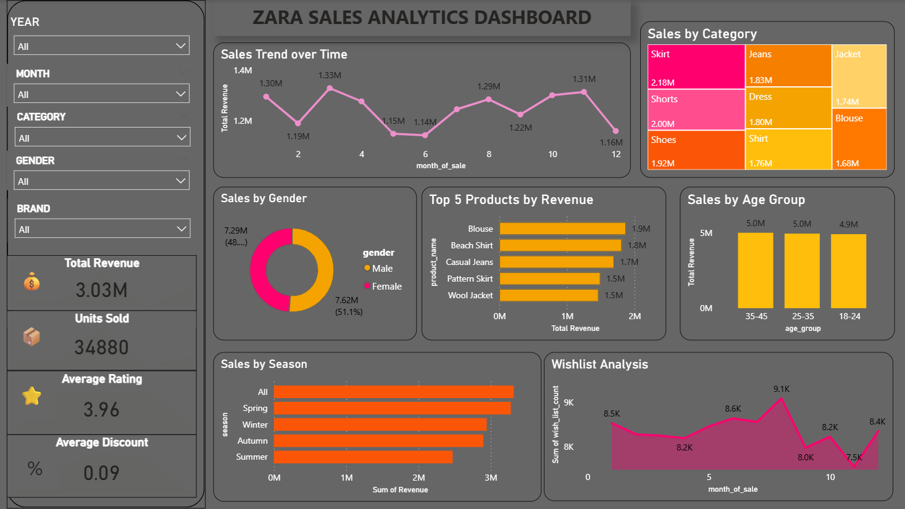

# ZARA Sales Analytics Dashboard

## Dashboard Preview

This project presents an interactive Power BI dashboard created using a fashion retail dataset. The dashboard analyzes sales performance, customer behavior, pricing trends, product ratings, and seasonal patterns.

## Dashboard Features
- KPI Cards for Total Sales, Average Price, Average Rating, and Wishlist Adds
- Sales trend analysis over time
- Category and gender-wise sales comparison
- Seasonal sales insights
- Price vs Sales relationship analysis
- Interactive visualizations and business insights

## Tools Used
- Microsoft Power BI
- DAX Measures
- Data Visualization

## Project Objective
The objective of this project is to transform raw retail data into meaningful insights and support data-driven business decisions using interactive dashboards.

## Key Insights
- Sales performance varies across categories and seasons
- Discounts influence customer engagement and sales
- Wishlist count reflects customer interest trends
- Product ratings help identify customer satisfaction patterns
